# Projekt-Koncowy-Analiza-danych
Projekt Analiza Danych mieszkania 
Analiza cen mieszkań — wynajem i zakup (2023–2024)


# Slajd 1:Projekt Koncowy Analiza danych mieszkań 
Analiza cen mieszkań — wynajem i zakup (2023–2024)

---

# Slajd 2: Agenda  
1. Cel analizy  
2. Dane i wstępne przetwarzanie  
3. Eksploracyjna analiza danych  
4. Model regresji i predykcja  
5. Analiza ceny za m²  
6. Kluczowe wnioski  
7. Rekomendacje  

---

# Slajd 3: Cel analizy
- Cel analizy 
Celem projektu było zbadanie rynku mieszkaniowego w Polsce na podstawie danych o wynajmie oraz zakupie mieszkań w latach 2023–2024.
Założeniem było zrosumieć i porównać struktury ofert, poziomu cen i różnic międzymiastowych, a także ocena opłacalności inwestycji w najem względem zakupu. I jak kształtują się ceny mieszkań na rynku sprzedaży i wynajmu
- Do analizy wykorzystano zbiór ofert z kilkunastu miast (m.in. Warszawa, Kraków, Gdańsk, Wrocław) zawierający informacje o powierzchni, liczbie pokoi, cenie, odległościach od kluczowych punktów usługowych oraz cechach budynku.
- Weryfikować, które cechy (powierzchnia, lokalizacja) mają największy wpływ  
- Przygotować rekomendacje dla pośredników i inwestorów

---

# Slajd 4: Dane i preprocessing  
- **Źródła**:  
  - apartments_pl_2024_06.csv, apartments_pl_2023_12.csv (zakup)  
  - apartments_rent_pl_2024_06.csv (wynajem)  
- **Wczytywanie**: funkcja `read_csv_with_fallback()`  
  - Automatyczne wykrywanie kodowania (chardet)  
  - Separator `;` lub `,`  
- **Czyszczenie**:  
  - Standaryzacja nazw miast (`clean_city_column()`)
  - Przed dalszymi krokami wykonano:
    •	wykrycie i kwantyfikację braków danych,
    •	imputację brakujących wartości metodą hot-deck,
  - Identyfikacja braków i imputacja:  
    - Mediana dla liczb  
    - Hot-deck dla `area` w ramach miasta
- **Wczytywanie:**
- Kod:  
  ```python
  dfs[key] = read_csv_with_fallback(path)
- **Czyszczenie miast:**
- Kod:  
  ```python
  def clean_city_column(df):
    df['city'] = df['city'].str.strip().str.title()
- **Imputacja:**
- Kod:  
  ```python
  df[num_cols] = df[num_cols].fillna(df[num_cols].median())

---

# Slajd 5: Braki w danych  
| Zbiór danych      | Wizualizacja                   | Cel                                  |
|-------------------|--------------------------------|--------------------------------------|
| Wynajem           | heatmap(isnull)                | Lokalizacja kolumn z brakami         |
| Zakup 2024        | heatmap(isnull)                | Skala braków przed imputacją         |
| Zakup 2023        | heatmap(isnull)                | Wskaźnik jakości danych              |

**Notatka Braki w danych wynajmu:**  
- Opis wykresu braki w danych wynajmu
- Ten wykres jest tzw. mapą braków danych (missing values map), która pokazuje gdzie i w jakich zmiennych brakuje informacji w bazie dotyczącej mieszkań na wynajem. Wykres pozwala ocenić, czy problem brakujących wartości jest rozproszony czy skumulowany w konkretnych kolumnach.
- Opis do prezentacji 
Na tym wykresie widzimy, które cechy mieszkań zawierają braki danych. Każda kolumna to jedna zmienna, a każdy wiersz to jedna oferta. Czerwone kreski wskazują miejsca, gdzie brakuje informacji — na przykład, dla wielu mieszkań nie podano typu budynku czy formy własności. Z kolei dane o lokalizacji, czyli długość i szerokość geograficzna, są niemal kompletne. Dzięki temu możemy lepiej zaplanować dalszą analizę – czy należy uzupełniać brakujące dane, czy pomijać niektóre zmienne.”

- Kod:  
  ```python
  sns.heatmap(df.isnull(), cbar=False, cmap="coolwarm")

- **Wizualizacja:**
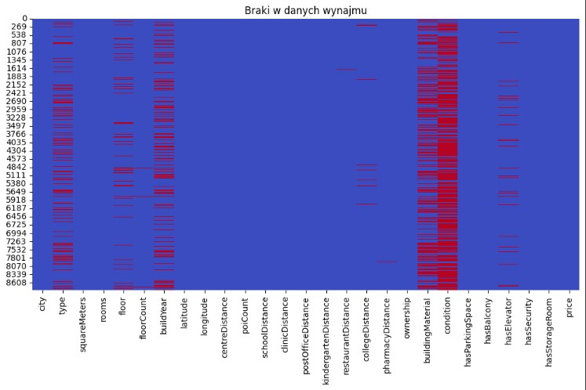


**Notatka Braki w danych zakupu 2024:**  
- Opis wykresu braki w danych zakupu 2024
- To wizualizacja brakujących danych (missing values plot) w zbiorze dotyczącym ofert sprzedaży mieszkań w roku 2024. Pokazuje dokładnie, które cechy mieszkań zawierają braki danych i w których rekordach te braki występują.
- Opis do prezentacji
- Ten wykres przedstawia jakość danych o mieszkaniach na sprzedaż. Pozioma oś pokazuje różne cechy ofert, a pionowa to poszczególne mieszkania. Czerwone kreski wskazują, gdzie brakuje informacji — np. dla wielu ofert nie podano liczby pokoi czy formy własności. Dzięki temu możemy szybko ocenić, które kolumny wymagają uzupełnienia, a które są dobrze wypełnione, co pomoże nam poprawić jakość analiz.
- Kod:  
  ```python
      for df, title in [
        (df_rent,     "Braki w danych wynajmu"),
        (df_buy_2024, "Braki w danych zakupu 2024"),
    ]:
        plt.figure(figsize=(12, 6))
        sns.heatmap(df.isnull(), cbar=False, cmap="coolwarm")
        plt.title(title)
        plt.show()


- **Wizualizacja:**
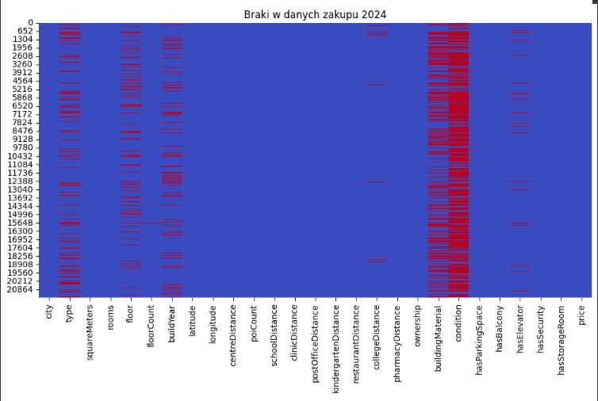

**Notatka Braki w danych  2023:**  
- Opis wykresu braki w danych zakupu 2023
- Wizualizacja pokazuje rozmieszczenie brakujących danych w zbiorze ofert sprzedaży mieszkań. Dzięki niej można szybko zobaczyć, w których zmiennych (kolumnach) najczęściej występują braki, i w jakich wierszach one się pojawiają.
- Opis do prezentacji
- Na tym wykresie widzimy, gdzie w danych o mieszkaniach brakuje informacji. Każda kolumna to cecha, a każda kreska to brakująca wartość dla jednej oferty. Widać, że dane techniczne takie jak metraż czy liczba pokoi są często nieuzupełnione, natomiast lokalizacja jest prawie kompletna. Taka analiza pomaga nam zdecydować, które zmienne możemy wykorzystać dalej, a które wymagają uzupełnienia lub odfiltrowania.
- Kod:  
  ```python
  sns.heatmap(df.isnull(), cbar=False, cmap="coolwarm")
      for df, title in [
        (df_rent,     "Braki w danych wynajmu"),
        (df_buy_2023, "Braki w danych zakupu 2023"),
    ]:
        plt.figure(figsize=(12, 6))
        sns.heatmap(df.isnull(), cbar=False, cmap="coolwarm")
        plt.title(title)
        plt.show()  
- **Wizualizacja:**


---

# Slajd 6: Boxplot – ceny zakupu mieszkan w róznych miastach 
- Cel:  
  - Pokazać rozrzut i outliery  
  - Porównać mediany i zakres cen  
- Kod:  
  ```python
  sns.boxplot(x="city", y="price", data=df_buy_2024, ax=ax)
  
- **Wizualizacja:**
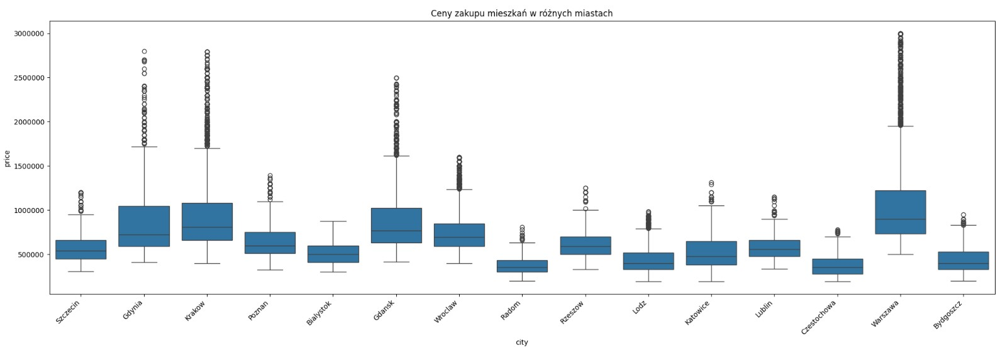

**Notatka Boxplot – ceny wg miast:**
- Opis histogramu:
- Histogram który ilustruje porównanie cen zakupu mieszkań w różnych miastach Polski. Każde „pudełko” reprezentuje jedno miasto i pokazuje, jak bardzo zróżnicowane są ceny mieszkań w jego obrębie — od najniższych do najwyższych.
- Opis do prezentacji:
- Tutaj widzimy wykres pudełkowy, który porównuje rozkład cen mieszkań w 15 miastach Polski. Każde pudełko obrazuje ceny od najtańszych do najdroższych – środkowa linia to mediana, czyli najczęściej spotykana cena. Im dłuższe pudełko, tym większe zróżnicowanie w ofertach. Warto tutaj zwrócić uwagę na Warszawę – jest nie tylko najdroższa, ale też bardzo zmienna, co widać po licznych kropkach z bardzo wysokimi cenami. Dla porównania – w Radomiu ceny są bardziej spójne i znacznie niższe.

----
# Slajd 6: Boxplot – ceny wynajmu mieszkan w róznych miastach   
- Cel:  
  - Pokazać rozrzut i outliery  
  - Porównać mediany i zakres cen  

-  Boxplot – ceny wg miast:
- Kod:  
  ```python
      sns.boxplot(x="city", y="price", data=df_rent)
- **Wizualizacja:**
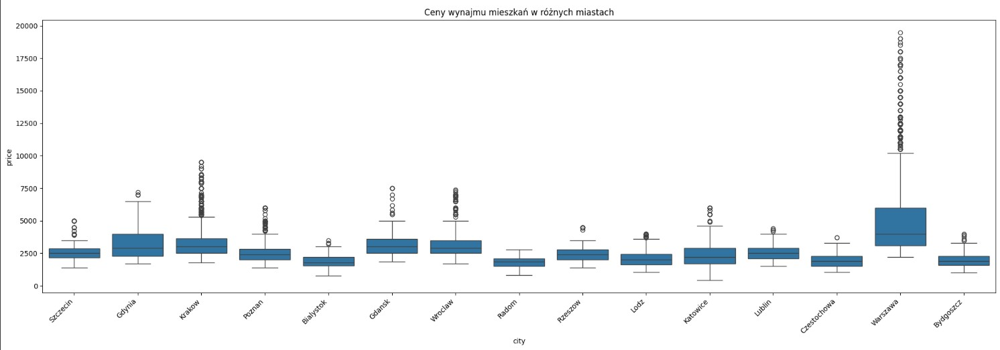  

**Notatka Boxplot – ceny wg miast:**
- Opis histogramu:
- Histogram pokazuje porównanie cen wynajmu mieszkań w różnych miastach Polski. Każde „pudełko” reprezentuje jedno miasto i pokazuje, jak bardzo zróżnicowane są ceny wynajmu w jego obrębie — od najniższych do najwyższych.
- Opis do prezentacji:
- Na Histogramie widzimy porównanie cen mieszkań w różnych miastach. Każde pudełko to zakres najczęściej występujących cen – od dolnych do górnych wartości typowych. Linia w środku to mediana, czyli cena ‘środkowa’. Warszawa ma najwyższą medianę i najwięcej odstających punktów, co świadczy o dużym zróżnicowaniu rynku – znajdziemy tam zarówno mieszkania na start, jak i apartamenty za kilka milionów. Dla kontrastu: miasta takie jak Radom są bardziej przewidywalne cenowo – mniej luksusowych ofert, ceny niższe i stabilniejsze.
---
# Slajd 8: Korelacje (zakup 2024)  
- Heatmapa korelacji zmiennych liczbowych  
- Kod:  
  ```python
  df_corr = numeric_df.corr()
  sns.heatmap(corr, annot=True, cmap="coolwarm", fmt=".2f")
**Notatka Heatmapa Korelacji:**
- Opis Hisotgramy heatmap
- Co przedstawia tA mapa ciepła (heatmapa) macierzy korelacji – każdy kwadrat pokazuje, jak bardzo dwie zmienne są ze sobą powiązane. To macierz korelacji przedstawiająca siłę i kierunek powiązań pomiędzy różnymi cechami ofert nieruchomości na sprzedaż
- Opis do prezentacji
- Na tym wykresie zobaczymy, jak cechy mieszkań wpływają na siebie nawzajem. Intensywny czerwony kolor między metrażem a liczbą pokoi (0.81) pokazuje , że większe mieszkania mają więcej pokoi – co jest intuicyjne. Ciekawostką jest ujemna korelacja między rokiem budowy a szerokością geograficzną – nowe budynki są częściej zlokalizowane bardziej na południu. To zestawienie pozwala szybko wyłapać, które cechy mogą się wzajemnie przewidywać i jakie zależności istnieją między lokalizacją, powierzchnią a ceną.
- **Wizualizacja:**
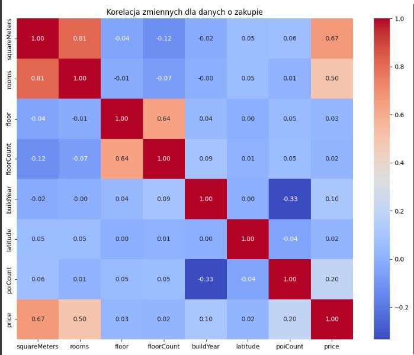
-----

# Slajd 9: Minimalne i maksymalne ceny
- Porównanie minimalnych i maksymalnych cen zakupu mieszkań w 2024 roku
- Heatmapa korelacji zmiennych liczbowych  
- Kod:  
  ```python
  mm = df_buy_2024.groupby('city')['price'].agg(['min', 'max']).reset_index()
**Notatka wykres Minimalne i maksymalne ceny ceny mieszkań:**
- Opis Wykresu:
- Wykres przedstawia rozpiętość cen mieszkań w największych miastach Polski — pokazując zarówno najtańszą, jak i najdroższą ofertę w każdym z nich.
- Opis do prezentacji:
- Na tym Wykresie widać, jak ogromne potrafią być różnice cen mieszkań – nie tylko między miastami, ale także wewnątrz każdego miasta. Kolor niebieski oznacza najtańszą dostępną ofertę, pomarańczowy – najdroższą. Dzięki temu możemy zrozumieć, które rynki mieszkaniowe są najbardziej zróżnicowane i gdzie występują oferty ‘premium’. Na przykład w Warszawie widzimy zarówno mieszkania poniżej 500 tys., jak i apartamenty za 3 mln zł
Wnioski:
Znaczne różnice w rozrzucie cen pomiędzy miastami
Warszawa i Kraków – najwyższe ceny maksymalne

-**Wizualizacja:**
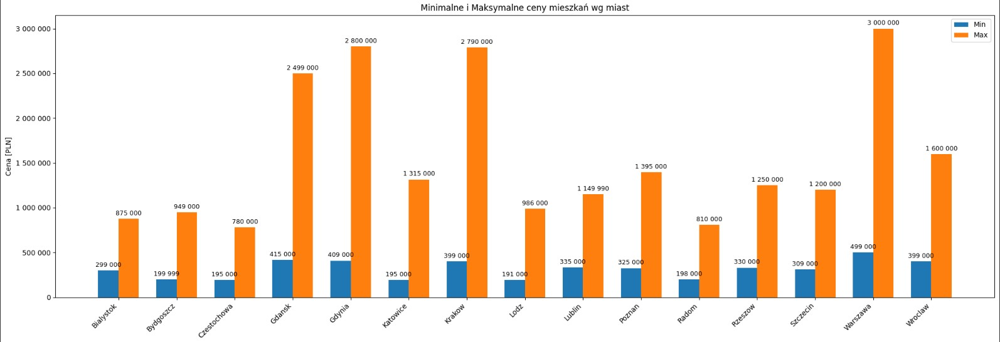

----


# Slajd 10: Kurtoza cen wg miast
Kurtoza: miara „spiczastości” rozkładu
Obliczona dla price w danych zakupu 2024
- Kod:  
  ```python
  df_buy_2024.groupby('city')['price'].apply(lambda x: x.kurtosis())
**Notatka Kurtoza cena mieszkań:**
- Opis Wykresu
- Wykres ten przedstawia wartości kurtozy rozkładu cen mieszkań w 15 największych miastach Polski.  Kurtoza to miara statystyczna opisująca kształt rozkładu danych, a konkretnie stopień "spłaszczenia" lub "wysmukłości" rozkładu w porównaniu do rozkładu normalnego. 
- Opis do prezentacji
- Ten wykres pokazuje nam, jak bardzo ‘rozciągnięty’ jest rozkład cen mieszkań w różnych miastach. Kurtoza mówi nam, czy w danym mieście występują ceny ekstremalnie wysokie lub niskie. Im wyższy słupek, tym bardziej 'szpiczasty' jest rozkład – a więc np. Warszawa, Gdynia i Kraków mają dużo ofert, które wybijają się ponad średnią cenę. Z kolei Białystok ma bardziej wyrównany rynek – ceny są zbliżone, bez aż tak dużej liczby luksusowych, bardzo drogich nieruchomości.
Wnioski:
Miasta o wysokiej kurtozie mają więcej ekstremalnych cen
Pozwala identyfikować rynki niestabilne lub spekulacyjne
- **Wizualizacja:**
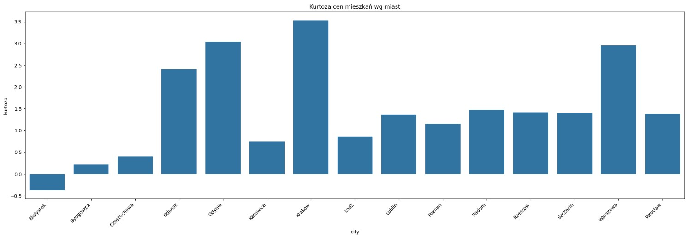

----

# Slajd 11: Statystyki opisowe dla wynajmu (heatmapy)
- Kod:  
  ```python
      for df, cmap, title in [
        (df_rent,     "YlGnBu", "Statystyki opisowe dla wynajmu"),
    ]:
        stats = df.describe().transpose()
        plt.figure(figsize=(12, 6))
        sns.heatmap(stats, annot=True, cmap=cmap, fmt=".2f")
        plt.title(title)
        plt.tight_layout()
        plt.show()
  
**Notatka Statystyki Opisowe dla wynajmu:**
- Opis Heatmap
- To mapa cieplna (heatmapa), która przedstawia wartości statystyk opisowych dla różnych cech mieszkań przeznaczonych na wynajem. Umożliwia szybkie porównanie miar takich jak: średnia, mediana, rozrzut i wartości skrajne dla takich atrybutów jak metraż, liczba pokoi, piętro, rok budowy czy cena.
- Opis do prezentacji
- Na tej mapie cieplnej widzimy zestawienie kluczowych miar statystycznych dotyczących wynajmowanych mieszkań. Kolumny odnoszą się do typowych miar, takich jak średnia czy mediana, a wiersze to cechy mieszkań. Dla przykładu, przeciętne mieszkanie ma 54 m², kosztuje 3704 zł i ma ok. 2,34 pokoju. Ciemne kolory, jak w przypadku ceny maksymalnej – niemal 19 500 zł – od razu wskazują wartości najwyższe. Takie wizualne przedstawienie danych ułatwia szybkie porównania bez potrzeby czytania tabeli liczbowej

- **Wizualizacja:**
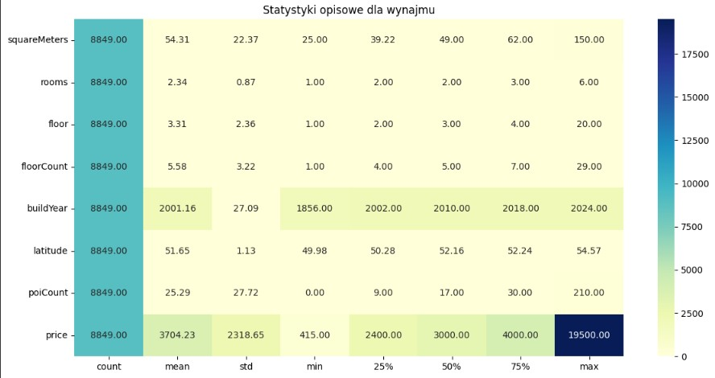
-----

# Slajd 11: Statystyki opisowe dla zakupu 2024 (heatmapy)
- Kod:  
  ```python
      for df, cmap, title in [
        (df_buy_2024, "YlOrRd", "Statystyki opisowe dla zakupu 2024"),
    ]:
        stats = df.describe().transpose()
        plt.figure(figsize=(12, 6))
        sns.heatmap(stats, annot=True, cmap=cmap, fmt=".2f")
        plt.title(title)
        plt.tight_layout()
        plt.show()
    
**Notatka Statystyki Opisowe dla zakupu:**
- Opis Heatmap
- Ta mapa cieplna statystyk opisowych dotyczących ofert zakupu mieszkań w 2024 roku. Umożliwia szybkie porównanie różnych cech nieruchomości i ich wartości liczbowych — np. średnia cena, liczba pokoi, czy rok budowy.
- Opis do prezentacji
- Ta mapa ciepła to zestawienie statystyk opisowych dla różnych cech mieszkań. Na osi Y mamy cechy jak metraż, liczba pokoi czy cena, a na osi X miary statystyczne – np. średnie, odchylenia i wartości maksymalne. Wartości liczbowe w kwadratach pozwalają ocenić poziomy każdej cechy, a kolory wskazują, które liczby są szczególnie wysokie. Na przykład, przy cenie widzimy ciemnoczerwone pole w kolumnie ‘max’, co sygnalizuje, że niektóre mieszkania kosztują nawet 3 mln zł. Natomiast jaśniejsze barwy przy liczbie pokoi czy piętrze pokazują, że te cechy są bardziej jednolite

- **Wizualizacja:**
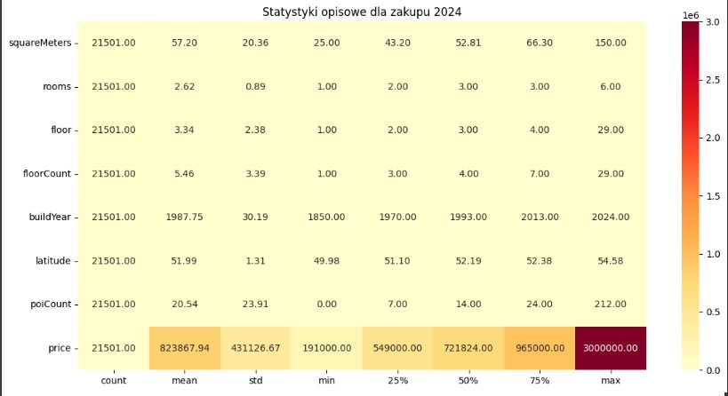
-----
# Slajd 12: Statystyki opisowe dla zakupu 2023 (heatmapy)
- Kod:  
  ```python
      for df, cmap, title in [
         (df_buy_2023, "BuPu",   "Statystyki opisowe dla zakupu 2023"),
    ]:
        stats = df.describe().transpose()
        plt.figure(figsize=(12, 6))
        sns.heatmap(stats, annot=True, cmap=cmap, fmt=".2f")
        plt.title(title)
        plt.tight_layout()
        plt.show()
    
**Notatka Statystyki Opisowe dla zakupu:**
- Opis Heatmap
- Zestawienie podstawowych statystyk opisowych (count, mean, std, min, 25%, 50%, 75%, max) dla siedmiu cech ofert nieruchomości w 2023 roku. Pokazuje w jednym miejscu: jakie wartości przyjmują różne cechy mieszkań (np. liczba pokoi, cena),oraz jak bardzo te wartości się różnią.
- Opis do prezentacji
- Na tej mapie cieplnej widzimy podsumowanie statystyczne różnych cech mieszkań, które były dostępne na rynku w 2023 roku. Oś pionowa to cechy ofert, takie jak cena, liczba pokoi czy rok budowy. Oś pozioma pokazuje, jakie miary statystyczne dla nich obliczono — średnią, odchylenie czy maksymalną wartość. Każdy kwadrat pokazuje konkretną liczbę, ale również kolorystycznie zaznacza, jak wysoka jest dana wartość. Na przykład: najciemniejsze pole to maksymalna cena mieszkania – aż 3,25 mln zł, natomiast najjaśniejsze wskazuje bardzo niskie wartości — np. minimalna liczba pokoi to 1. Dzięki tej wizualizacji można ocenić, które cechy mieszkań są bardziej zróżnicowane i gdzie dominują wartości ekstremalne

- **Wizualizacja:**
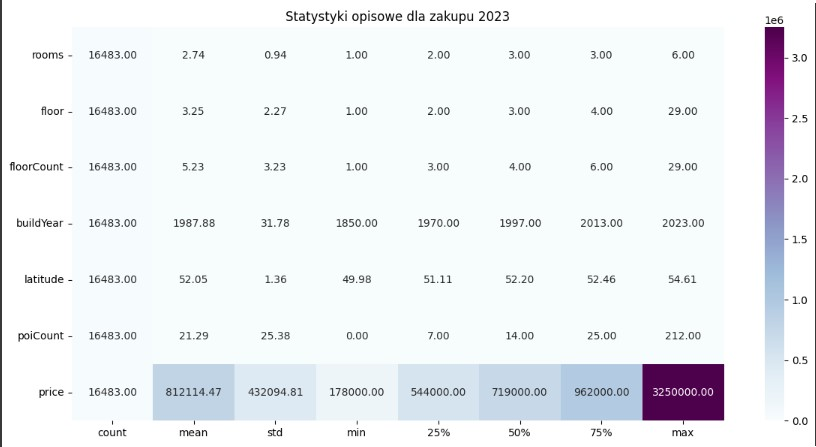
-----
# Slajd 13: ROI – opłacalność wynajmu
- Mediana czynszu / Mediana ceny zakupu × 100%
- ROI wyrażony procentowo – ile wynosi roczny zwrot z inwestycji
- Kod:  
  ```python
  roi      = (rent_med / buy_med * 100).sort_values(ascending=False)
  sns.barplot(x=roi.index, y=roi.values)

- Opis wykresu Opłacalnosć wynajmu względem zakupu
- To histogram słupkowy, który ilustruje średni roczny zwrot z inwestycji (ROI) z wynajmu mieszkań w 14 miastach Polski. ROI (Return on Investment) to procentowy wskaźnik mówiący, jak duży zwrot roczny inwestor uzyskuje z najmu nieruchomości w stosunku do ceny zakupu.
- Opis do prezentacji
- Ten wykres pokazuje, jak bardzo opłacalny jest najem mieszkań w różnych miastach. Wysokość słupka to średni roczny zwrot z inwestycji w danym mieście – czyli ile procent ceny zakupu odzyskujemy co roku z najmu. Radom i Częstochowa oferują najwyższy ROI – tam zyski z najmu są proporcjonalnie najwyższe. W Warszawie ROI jest umiarkowane – mimo wysokich czynszów, ceny zakupu są jeszcze wyższe. Najniższy zwrot widzimy w Białymstoku – co może zniechęcać inwestorów szukających szybkiego zwrotu

- Wnioski Najbardziej opłacalne miasta:
Gorzów Wlkp., Bydgoszcz, Rzeszów
Miasta z niskim ROI:
Warszawa, Gdańsk, Kraków

- **Wizualizacja:**
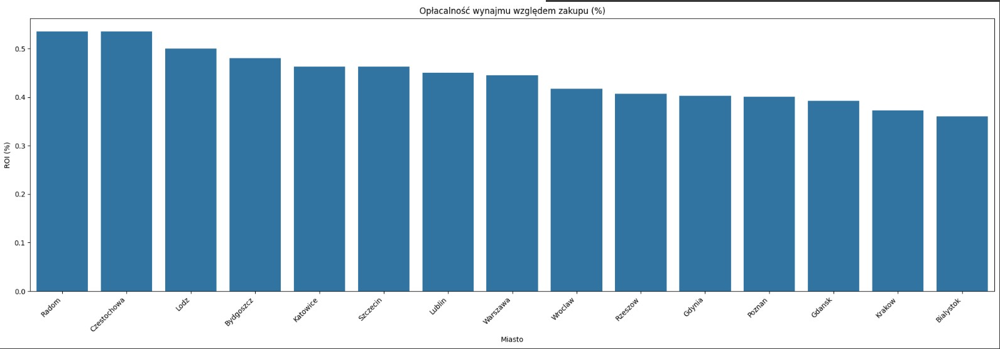
-----
# Slajd 14: Wykres średniej ceny za m²

- Kod:  
  ```python
          fig, ax = plt.subplots(figsize=(20, 6))
        sns.barplot(x='city', y='Średnia', data=stats_m2,
                    palette='viridis', ax=ax)
        ax.set_title("Średnia cena za m² mieszkania (zakup 2024) wg miast")
        ax.set_ylabel("Cena [PLN/m²]")
        ax.set_xlabel("Miasto")
        ax.yaxis.set_major_formatter(FuncFormatter(lambda v, pos: f"{int(v):,}".replace(",", " ")))
        plt.xticks(rotation=45, ha='right')
        for p in ax.patches:
            h = int(p.get_height())
            ax.annotate(
                f"{h:,}".replace(",", " "),
                (p.get_x() + p.get_width() / 2, h),
                ha='center', va='bottom', fontsize=9
            )
        plt.tight_layout()
        plt.show()

- Opis Wykres
-  To histogram słupkowy, który wizualizuje średnią cenę 1 m² mieszkania w 15 największych miastach Polski, na podstawie danych z 2024 roku. Wykres umożliwia szybkie porównanie poziomu cen między lokalizacjami.
- Opis do prezentacji
- Na wykresie widzimy średnie ceny mieszkań w wybranych miastach Polski. Każdy słupek obrazuje wartość przeciętnego mieszkania – im wyższy, tym droższy rynek. Warszawa zdecydowanie przoduje pod względem cen, z średnią przekraczającą milion złotych, podczas gdy Radom i Częstochowa pozostają najbardziej przystępne cenowo. Taki wykres pozwala szybko zorientować się, które miasta są droższe, a które bardziej dostępne dla kupujących.
- Wnioski:
Najwyższe stawki: Warszawa, Gdańsk , Kraków
Duża zmienność w miastach turystycznych

- **Wizualizacja:**
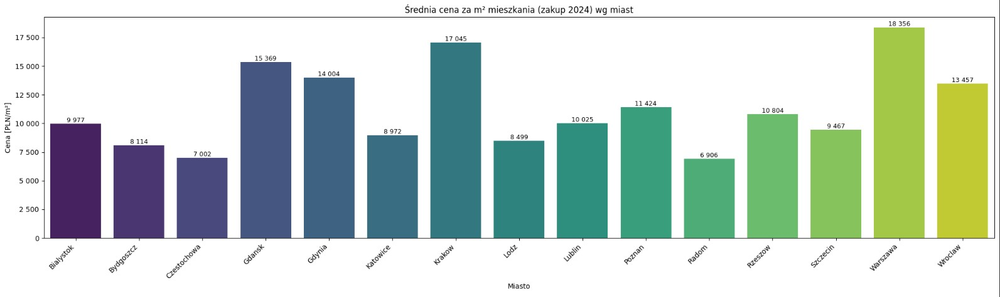


----
# Slajd 15: Histogram Box plot Rozkład cen za m2 

- Kod:  
  ```python
          fig, ax = plt.subplots(figsize=(20, 6))
        sns.boxplot(x='city', y='price_per_m2',
                    data=df_buy_2024,
                    palette='magma',
                    ax=ax)
        ax.set_title("Rozkład cen za m² mieszkań (zakup 2024) wg miast")
        ax.set_ylabel("Cena [PLN/m²]")
        ax.set_xlabel("Miasto")
        plt.xticks(rotation=45, ha='right')

        # definiujemy zakres osi Y 
        y_min = df_buy_2024['price_per_m2'].min()
        y_max = df_buy_2024['price_per_m2'].max()
        yticks = np.linspace(y_min, y_max, 5)
        ax.set_ylim(y_min, y_max)
        ax.yaxis.set_major_locator(FixedLocator(yticks))
        ax.yaxis.set_major_formatter(FuncFormatter(lambda v, pos: f"{int(v)}"))
        plt.tight_layout()
        plt.show()
  
- Opis wykresu
- Ten wykres pudełkowy prezentuje roczny zwrot z inwestycji (ROI) z wynajmu mieszkań w 14 polskich miastach. Dzięki boxplotowi możemy porównać nie tylko wartości średnie, ale też zakresy i zróżnicowanie ROI w każdym mieście. 
- Opis do prezentacji
- Tutaj widzimy wykres pudełkowy, który pokazuje, jak bardzo różnią się stopy zwrotu z najmu w zależności od miasta. Każde pudełko to 50% najczęstszych wartości – linia w środku to typowy zwrot roczny. Warszawa ma umiarkowany ROI, ale w Radomiu i Częstochowie opłacalność jest zdecydowanie wyższa. Z kolei Kraków i Białystok mają bardzo niskie wartości – tam inwestycje zwracają się znacznie wolniej. Dzięki tej formie prezentacji od razu widzimy też, jak bardzo zróżnicowane są miasta między sobą.
  
- Wnioski:
Najwyższe stawki: Warszawa, Gdańsk
Duża zmienność w miastach turystycznych

- **Wizualizacja:**
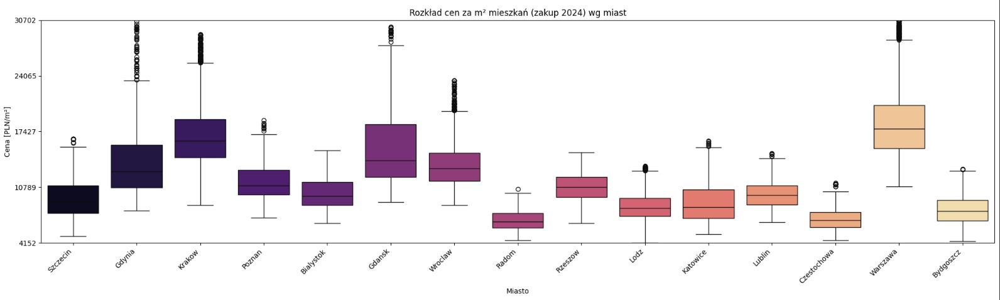

-----

# Slajd 15: Rozkład powierzchni mieszkań
- Kod:  
  ```python
          plt.figure(figsize=(20, 6))
        sns.histplot(df_buy_2024['squareMeters'],
                     bins=20, kde=True)
        plt.title("Rozkład powierzchni mieszkań po imputacji (df_buy_2024)")
        plt.xlabel("Powierzchnia (m²)")
        plt.ylabel("Liczba mieszkań")
        plt.tight_layout()
        plt.show()

    from scipy.stats import chi2_contingency

    def cramers_v(x, y):
        contingency = pd.crosstab(x, y)
        chi2, _, _, _ = chi2_contingency(contingency)
        n = contingency.values.sum()
        return np.sqrt(chi2 / (n * (min(contingency.shape) - 1)))

- Opis wykresu
- Wykres pokazuje, ile jest ofert mieszkań w poszczególnych miastach Polski (dane z 2024 r., po uzupełnieniu braków metodą hot-deck).
- Opis do prezentacji
- Ten wykres pokazuje, ile mieszkań znajduje się w naszym zbiorze danych w poszczególnych miastach Polski. Każdy słupek to konkretne miasto – im wyższy, tym więcej mieszkań. Zdecydowanie wyróżnia się Warszawa z największą liczbą ofert. Niebieska linia to krzywa gęstości – pokazuje ogólny trend, że najwięcej miast ma umiarkowaną liczbę mieszkań, a tylko nieliczne (jak Warszawa czy Kraków) wyraźnie odstają pod względem liczebności.

- Główne wnioski:
Większość mieszkań ma powierzchnię 30–60 m²
Pojedyncze wartości skrajne (ponad 100 m²)

-**Wizualizacja:**
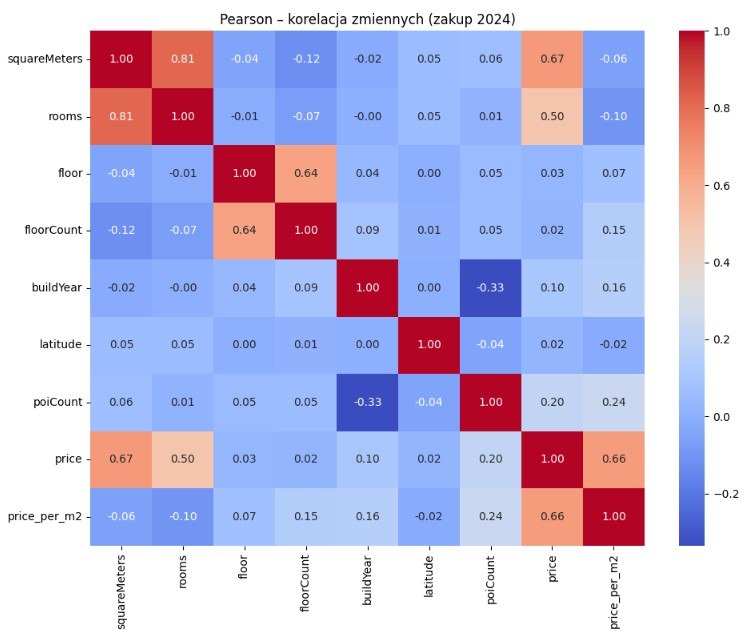

-----

# Slajd 16: Korelacje liczbowych – Pearson
Pearson – liniowa korelacja między zmiennymi liczbowymi

- Kod:  
  ```python
   numeric = df_buy_2024.select_dtypes(include=[np.number])
    pearson_m = numeric.corr(method='pearson')
  
    plt.figure(figsize=(10, 8))
    sns.heatmap(pearson_m, annot=True, fmt=".2f", cmap="coolwarm")
    plt.title("Pearson – korelacja zmiennych (zakup 2024)")
    plt.tight_layout(); plt.show()

  
- Opis Heatmap
- To macierz korelacji Pearsona pokazująca, jak silnie są ze sobą powiązane różne cechy mieszkań oferowanych do zakupu w 2024 r. Korelacja pozwala ocenić, czy zmiany jednej cechy (np. powierzchni) mają wpływ na inną (np. cenę).
- Opis do prezentacji
- Na tej heatmapie  przedstawiamy korelacje między cechami mieszkań. Widzimy, że powierzchnia jest bardzo silnie powiązana z liczbą pokoi (0.81), co jest intuicyjne. Co ciekawe, cena za m² jest niemal niezależna od liczby pięter czy szerokości geograficznej, ale słabo ujemnie związana z liczbą punktów usługowych. Kolory kwadratów pomagają szybko rozróżnić, które cechy wpływają na siebie – na przykład ciemna czerwień przy squareMeters i rooms wskazuje silną korelację dodatnią.

- Wnioski:
Silna dodatnia korelacja: cena vs powierzchnia
Zmienne ilościowe mają niską korelację między sobą poza price

-**Wizualizacja:**
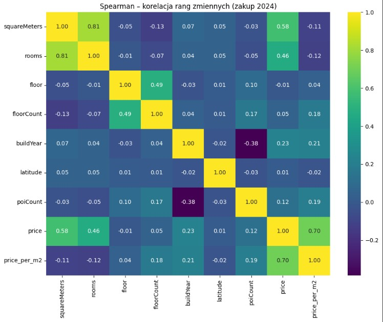

-----
# Slajd 17: Korelacje liczbowych – Spearman
Spearman – korelacja rang (monotoniczna)

- Kod:  
  ```python
  numeric = df_buy_2024.select_dtypes(include=[np.number])
    spearman_m = numeric.corr(method='spearman')

    plt.figure(figsize=(10, 8))
    sns.heatmap(spearman_m, annot=True, fmt=".2f", cmap="viridis")
    plt.title("Spearman – korelacja rang zmiennych (zakup 2024)")
    plt.tight_layout(); plt.show()

- Opis Heatmap
-  To macierz korelacji rang Spearmana, która pokazuje, jak silny i kierunkowy jest związek pomiędzy parami zmiennych opisujących oferty sprzedaży mieszkań. Korelacja rangowa uwzględnia nie tylko wartości liczbowe, ale też ich uporządkowanie (rangi) – dzięki czemu jest odporna na wartości odstające i dobrze sprawdza się przy cechach niemierzalnych liniowo.
- Opis do prezentacji
- Ten wykres pokazuje, jak mocno powiązane są ze sobą różne cechy mieszkań. Na przykład powierzchnia mieszkania silnie koreluje z liczbą pokoi – co jest intuicyjne. Widzimy też umiarkowany związek między metrażem a ceną. Co ciekawe, rok budowy wykazuje ujemny związek z liczbą POI – co może sugerować, że starsze budynki są zlokalizowane w bardziej rozwiniętej części miasta. Kolorystyka pomaga szybko dostrzec, które cechy wpływają na siebie silnie, a które pozostają niezależne.
  
- Wnioski:
Silna dodatnia korelacja: cena vs powierzchnia
Zmienne ilościowe mają niską korelację między sobą poza price

-**Wizualizacja**
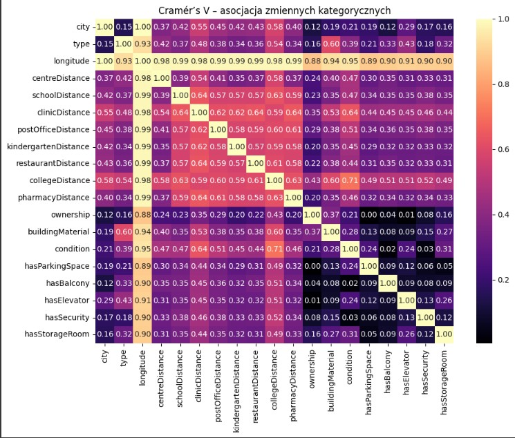

------

# Slajd 18: Cramér’s V – zmienne kategoryczne ilościowe

- Kod:  
  ```python
  cat_cols = df_buy_2024.select_dtypes(include=['object', 'category']).columns
    cramer_df = pd.DataFrame(index=cat_cols, columns=cat_cols, dtype=float)
    for c1 in cat_cols:
        for c2 in cat_cols:
            cramer_df.loc[c1, c2] = cramers_v(df_buy_2024[c1], df_buy_2024[c2])

    plt.figure(figsize=(10, 8))
    sns.heatmap(cramer_df.astype(float), annot=True, fmt=".2f", cmap="magma")
    plt.title("Cramér’s V – asocjacja zmiennych kategorycznych")
    plt.tight_layout(); plt.show()

- Opis
- To macierz korelacji Cramér's V — czyli wykres pokazujący siłę powiązań (asocjacji) pomiędzy różnymi zmiennymi kategorycznymi opisującymi mieszkania w zbiorze sprzedażowym. Cramér’s V przyjmuje wartości od 0 do 1:
0 – brak zależności
1 – pełna, silna zależność
- Opis do prezentacji
- Na tym wykresie zobaczymy, jak bardzo różne cechy mieszkań są ze sobą powiązane. Im jaśniejszy kwadrat, tym silniejszy związek. Na przykład, długość geograficzna i odległość od centrum mają niemal idealną korelację (0.99), co może świadczyć o geograficznej charakterystyce miast. Inne silne zależności pojawiają się między odległościami od usług — szkoły, restauracje czy apteki często zlokalizowane są blisko siebie. Dzięki kolorom i wartościom możemy szybko rozpoznać, które cechy mogą się wzajemnie tłumaczyć i wspierać w modelach analitycznych.

-Wnioski:
Miernik siły asocjacji między cechami nominalnymi
Obliczony dla par kolumn kategorycznych
Przykłady: city, district, street
Ciepłe kolory = silniejsze powiązanie

-**Wizualizacja**
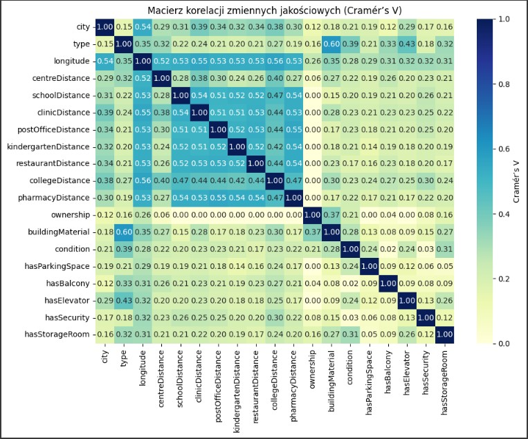

-----
# Slajd 18: Cramér’s V – zmienne kategoryczne jakościowe 

- Kod:  
  ```python
  # Korelacja jakościowa – Cramér’s V
  cat_cols = df_buy_2024.select_dtypes(include=['object', 'category']).columns.tolist()
  n = len(cat_cols)
  cramer_matrix = pd.DataFrame(np.zeros((n, n)), index=cat_cols, columns=cat_cols)
  for i, c1 in enumerate(cat_cols):
  for j, c2 in enumerate(cat_cols):
        if i <= j:
            v = cramers_v(df_buy_2024[c1], df_buy_2024[c2])
            cramer_matrix.loc[c1, c2] = v
            cramer_matrix.loc[c2, c1] = v
  plt.figure(figsize=(10, 8))
  sns.heatmap(
    cramer_matrix,
    annot=True,
    fmt=".2f",
    cmap="YlGnBu",
    cbar_kws={'label': "Cramér’s V"}
  )
  plt.title("Macierz korelacji zmiennych jakościowych (Cramér’s V)")
  plt.tight_layout()
  plt.show()
- Opis
- To macierz korelacji Cramér’s V, używana do oceny siły związku między zmiennymi jakościowymi (kategorycznymi) opisującymi cechy mieszkań oraz lokalizacji. Umożliwia szybkie wychwycenie, które cechy współwystępują ze sobą, a które są niezależne.
- Opis do prezentacji
- Na tym wykresie mamy macierz korelacji Craméra – pokazuje ona siłę związku między zmiennymi jakościowymi. Na przykład bardzo silny związek występuje między długością geograficzną a odległością od centrum – co jest logiczne, bo lokalizacja wpływa na centralność mieszkania. Z kolei wyposażenie jak balkon czy komórka lokatorska występują raczej niezależnie od innych cech. Kolorystycznie ciemniejsze pola wskazują na silniejsze współwystępowanie dwóch cech. To pozwala wychwycić powiązania między atrybutami, które często nie są widoczne w tradycyjnej tabeli.

-**Wizualizacja**


------
# Slajd 19: Kluczowe wnioski

-**Wnioski:**
Kluczowe wnioski
•	Rynek najmu: średnia stawka 3 700 PLN, duże zróżnicowanie cen (IQR 415–4 000 PLN), najwyższe w Warszawie i Trójmieście.
•	Rynek zakupu: średnia cena wzrosła tylko o 1,4 % r/r do ok. 824 tys. PLN, silna prawoskośność (oferty >3 mln PLN głównie w największych miastach).
•	Cena a metraż: współczynnik Pearsona 0,67 – wielkość mieszkania to najsilniejszy determinant ceny; liczba pokoi również istotna (0,50).
•	Ceny za m²: od ok. 6 900 PLN (Radom, Białystok) do ponad 17 500 PLN (Warszawa).
•	ROI najmu vs zakupu: bardzo niski (średnio 0,25 % rocznie), z najwyższym zwrotem w mniejszych ośrodkach (Radom, Bydgoszcz).

------

# Slajd 20: Rekomendacje
Dla pośredników:
Skupienie na miastach o niskim ROI przy sprzedaży
Analiza outlierów dla nietypowych ofert

Dla inwestorów:
Priorytet dla miast o wysokim ROI
Uwzględnianie cen za m², nie tylko całkowitych cen

----


